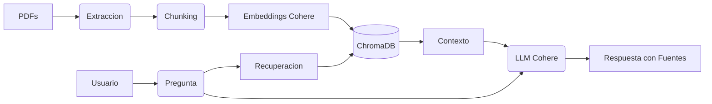

# 🤖 Challenge Alura Agente — NexusEcom RAG Agent

> Agente de Inteligencia Artificial corporativo basado en RAG (Retrieval-Augmented Generation) para responder preguntas de colaboradores a partir de documentos internos de NexusEcom.


## 🌐 Aplicación en Vivo

Prueba el asistente RAG corporativo directamente desde tu navegador:

**🚀 Despliegue Principal en Producción (Oracle Cloud - OCI)**
[-red?style=for-the-badge&logo=oracle)](http://157.137.217.80:8501/)

**☁️ Despliegue Secundario (Streamlit Community Cloud)**
[](https://challenge-alura-agente-jjs2cenbgnt548arbyljcw.streamlit.app/)

---

## Descripcion del Proyecto

**NexusEcom** es una tienda online de e-commerce multiplataforma. Este agente permite a los colaboradores consultar documentos corporativos internos de forma inteligente, obteniendo respuestas precisas y con fuentes citadas.

### Documentos indexados
| Categoria | Documento |
|-----------|-----------|
| Politicas | Politica de Reembolsos y Devoluciones |
| Logistica | Guia de Tiempos y Costos de Envio |
| Pagos | Preguntas Frecuentes sobre Metodos de Pago |
| Afiliados | Programa de Afiliados |
| Garantias | Manual de Garantia de Productos |

---

## Stack Tecnologico

| Componente | Tecnologia |
|------------|-----------|
| LLM | Cohere `command-r-plus-08-2024` |
| Embeddings | Cohere `embed-multilingual-v3.0` |
| Base Vectorial | ChromaDB |
| Orquestacion RAG | LangChain >= 0.2 |
| Interfaz | Streamlit |
| Deploy | Oracle Cloud Infrastructure (OCI) |
| Lenguaje | Python 3.13 |

---

## Estructura del Proyecto

```
Challenge-Alura-Agente/
├── Challenge_Alura_Agente.ipynb  # Cuaderno principal del pipeline
├── requirements.txt              # Dependencias del proyecto
├── .env.example                  # Plantilla de variables de entorno
├── .gitignore                    # Archivos excluidos del repo
├── src/
│   ├── __init__.py
│   ├── config.py                 # Configuracion centralizada
│   ├── ingestion/                # Modulo de ingesta de documentos
│   ├── retrieval/                # Modulo de recuperacion RAG
│   └── interface/                # Interfaz Streamlit
├── docs/                         # Documentos internos (excluidos del repo)
│   ├── politicas/
│   ├── logistica/
│   ├── pagos_y_facturacion/
│   ├── marketing_afiliados/
│   └── garantias_y_soporte/
├── tests/                        # Tests unitarios
└── config/                       # Configuraciones adicionales
```

---

## Instalacion y Configuracion

### 1. Clonar el repositorio
```bash
git clone https://github.com/Dannydejesus/Challenge-Alura-Agente.git
cd Challenge-Alura-Agente
```

### 2. Crear entorno virtual
```bash
python -m venv "Alura Agente"
# Windows
& ".\Alura Agente\Scripts\Activate.ps1"
```

### 3. Instalar dependencias
```bash
pip install -r requirements.txt
```

### 4. Configurar variables de entorno
```bash
copy .env.example .env
# Editar .env y agregar tu COHERE_API_KEY
```

Obtener API Key gratuita en: https://dashboard.cohere.com/api-keys

### 5. Agregar documentos
Coloca tus documentos en las carpetas correspondientes dentro de `docs/`.

### 6. Ejecutar el cuaderno
Abre `Challenge_Alura_Agente.ipynb` y ejecuta las celdas en orden.

---

## Arquitectura de la Solucion

El sistema implementa un flujo RAG (Retrieval-Augmented Generation) clásico con las siguientes etapas:

1. **Ingesta y Procesamiento (ETL):** Los documentos PDF se leen usando `PyMuPDF` y se dividen en fragmentos (chunks) semánticos usando `RecursiveCharacterTextSplitter` de LangChain.
2. **Indexación Vectorial:** Cada chunk se transforma en un vector (embedding) usando el modelo `embed-multilingual-v3.0` de Cohere y se almacena en `ChromaDB`.
3. **Recuperación (Retrieval):** Ante una pregunta del usuario, el sistema busca los chunks más relevantes en la base vectorial mediante búsqueda semántica.
4. **Generación (Generation):** Se construye un prompt con la pregunta y el contexto recuperado, enviándolo al LLM (`command-r-plus-08-2024` de Cohere) para generar una respuesta en lenguaje natural citando las fuentes.



---

## Ejemplos de Uso

### Ejemplos de preguntas que el agente puede responder:
- *"¿Cómo puedo solicitar el reembolso de un producto dañado?"*
- *"¿Cuáles son los tiempos de entrega para envíos internacionales?"*
- *"¿Qué porcentaje de comisión gano en el programa de afiliados?"*
- *"¿Aceptan pagos con criptomonedas o PayPal?"*
- *"¿Cuánto tiempo de garantía tiene un teléfono móvil?"*

### Ejemplos de respuestas generadas por el agente:

**Pregunta:** *¿Cómo puedo solicitar el reembolso de un producto dañado?*

**Respuesta generada:**
> Para solicitar el reembolso de un producto dañado, debes comunicarte con el área de soporte al cliente dentro de los primeros 7 días posteriores a la recepción del pedido. Es necesario proporcionar fotografías claras del daño y el número de orden. Una vez aprobado, el reembolso se procesará al método de pago original en un plazo de 3 a 5 días hábiles.
> 
> *Fuente: [Fuente 1: Politica_Reembolsos_NexusEcom.pdf | politicas]*

---

## Roadmap

- [x] Fase 0 — Setup y configuracion del entorno
- [x] Fase 1 — Colecta y organizacion de documentos
- [ ] Fase 2 — Procesamiento y extraccion de contenido
- [ ] Fase 3 — Indexacion vectorial en ChromaDB
- [ ] Fase 4 — Capa RAG de recuperacion
- [ ] Fase 5 — Generacion de respuestas con Cohere
- [ ] Fase 6 — Interfaz Streamlit
- [ ] Fase 7 — Deploy en Oracle Cloud Infrastructure
- [ ] Fase 8 — Registro y cierre del challenge

---

## Autor

**Danny De Jesus**  
Challenge Alura Agente — ONE Oracle Next Education + Alura Latam  

---

## Licencia

Proyecto educativo — Challenge Alura ONE.
